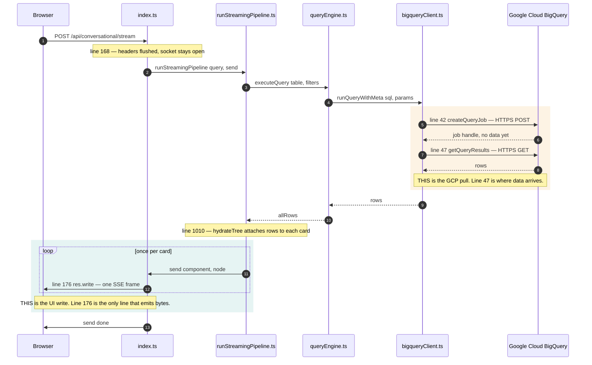
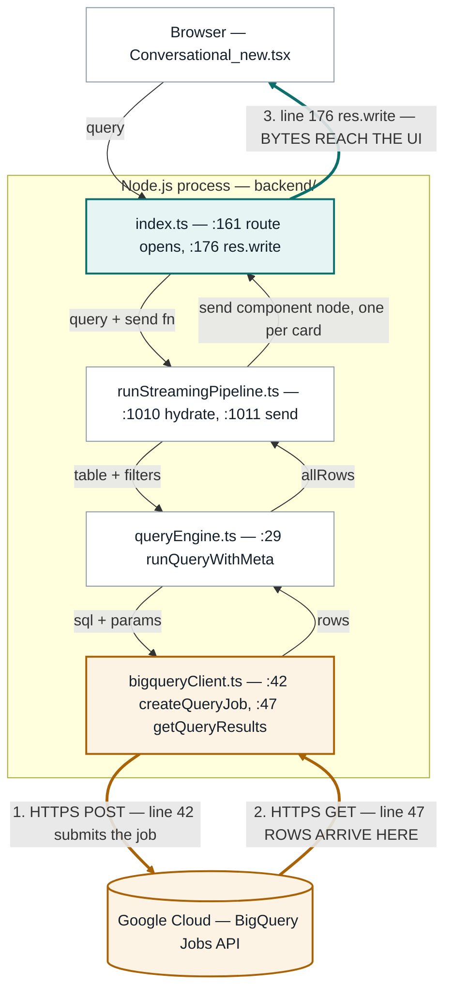

# Where data is pulled from GCP, and where it reaches the UI

Two diagrams of the same request. Every file path and line number below was read out of the
code. Only **two lines in the whole backend do I/O** — everything else is transformation.

| # | What | File | Line |
|---|---|---|---|
| 1 | Submits the query job to Google Cloud | `backend/src/lib/bigqueryClient.ts` | **42** |
| 2 | **Rows arrive from Google Cloud** | `backend/src/lib/bigqueryClient.ts` | **47** |
| 3 | **Bytes are written to the browser** | `backend/src/index.ts` | **176** |

Supporting lines: `index.ts:168` flushes the SSE headers and holds the socket open;
`runStreamingPipeline.ts:1010` attaches the rows to a card; `:1011` calls `send`, once per card.

---

## 1. Request trace — the order things happen



**Read it as:** the query goes down the participants left to right, crosses into Google Cloud in
the amber block, and comes back. Note that BigQuery takes **two HTTP round trips** — it is a
job-based API, so there is no single-call execute. The teal block loops: one `res.write` per
card, which is why the report appears to build itself on screen rather than arriving all at once.

---

## 2. Layer view — what sits inside the process, and what doesn't



**Read it as:** the dashed box is our own process. The two thick amber arrows are the only
traffic that leaves it for Google Cloud; the thick teal arrow is the only traffic that reaches
the browser. Everything drawn inside the box is a plain in-process function call.

---

## Why there is exactly one door to GCP

Grepped across the whole backend — these are complete counts, not samples.

| Searched for | Hits | Where |
|---|---|---|
| `new BigQuery(` | 2 | both inside `bigqueryClient.ts` (lines 14, 18) |
| `createQueryJob` / `getQueryResults` | 2 | both inside `bigqueryClient.ts` (lines 42, 47) |
| `runQueryWithMeta()` / `runQuery()` | 26 | `queryEngine`, `kagBuilder`, `catalogRefresher`, `llmHandler`, `bigqueryService`, `runStreamingPipeline` — **none touch the SDK directly** |

So a query timeout, a cost cap, a dry-run switch or a per-request audit log has exactly one place
to go: line 42. There is no second path to forget.

**Auth** is established once at module load (`bigqueryClient.ts:9-21`) — a service-account key
from `.env`, or `gcloud` Application Default Credentials as a fallback. The SDK signs a JWT,
exchanges it for an OAuth2 token, and attaches a bearer header to both HTTP calls. There is no
connection string and no pool: each query is an independent HTTPS request.

---

## Seeing it happen

Both edges log themselves. Run one query and watch the backend console:

```
[BigQuery ENTRY] project=data-practice-472314 dataset=report_hub_demo table=v_daily_sales_detail
[BigQuery EXIT]  table=v_daily_sales_detail rows=120 duration=340ms
```

In the browser: DevTools → Network → the `/api/conversational/stream` request → **EventStream**.
Every frame listed there was produced by line 176, one `res.write` at a time.

---

## One caveat worth knowing before touching this code

`bigqueryService.ts:109` exposes `runRawQuery(sql)`, which executes an arbitrary SQL string. It
still routes through line 42, so it inherits the auth and the logging — but it **bypasses
`buildQuerySQL`**, which means no parameter binding and no identifier allowlist. Safe only while
every caller passes a literal built in our own code. Worth an audit if anything user-derived ever
reaches it.

---

## Notes on these diagrams

Both blocks render natively in GitHub, GitLab, Notion, Confluence (Mermaid macro), VS Code's
Markdown preview, and <https://mermaid.live>. They were verified by rendering them with this
repo's pinned `mermaid@11.16.0` in headless Chromium under two configurations — stock defaults
and this app's `htmlLabels:false` config — and both pass `guardMermaid()`, so they can also be
displayed inside the app itself.

No `<br/>` is used anywhere on purpose: `mermaidGuard.ts` refuses any tag-open in diagram source,
so a multi-line label written that way renders on GitHub but is rejected by our own renderer.
