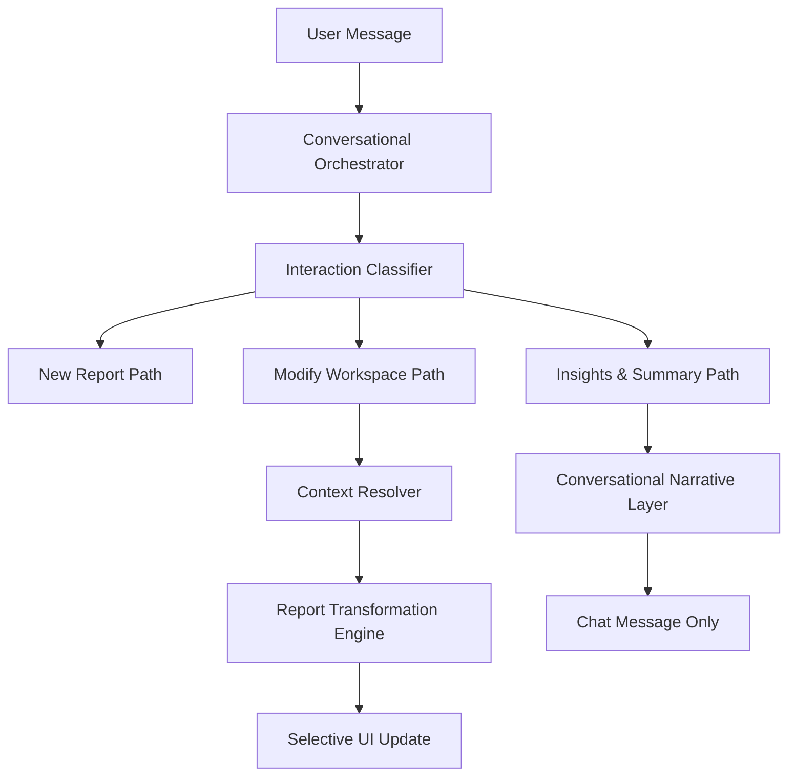

# Conversational BI Workspace Architecture Plan

## 1. Current Analytical Architecture
The system currently operates as a deterministic pipeline with an LLM-driven orchestration layer.
- **Entry Point:** `runStreamingPipeline.ts`
- **Intent Layer:** `analyzeQuery` (Clarify vs Route)
- **Data Layer:** `queryEngine.ts` (BigQuery execution)
- **Design Layer:** `llmHandler.ts` (`generateReport` or `classifyAndEditReport`)
- **Hydration Layer:** `hydrateTree` (Attaching BQ data to UI components)
- **State:** Stateless on backend; state passed via `priorContext`, `activeTable`, and `currentCards` from frontend.

## 2. Current Conversational Problems
- **Context Loss:** Every "data change" request (e.g., "show top 5") triggers a full report regeneration, often losing previously valid charts or layout configurations.
- **Redundant Execution:** Follow-up questions often rerun expensive BigQuery queries and full LLM design cycles even when only a filter or a visualization change is needed.
- **Noisy Narratives:** The system struggles to "just answer" a question about the report (e.g., "summarize this") without rebuilding the entire UI.
- **Structural Fragility:** Structural edits rely on the LLM returning the entire card tree correctly, which is prone to hallucinating missing components or columns.

## 3. Root Cause Analysis
The system lacks a **Stateful Workspace Manager**. It treats the current report as a "static snapshot" rather than an "active workspace".
- `edit_data_change` branch in the pipeline is too aggressive (full regeneration).
- No distinction between "Analysing Data" and "Analysing the Report".
- No mechanism for "Surgical UI Updates" (patching instead of replacing).

## 4. Why Stateless Prompt Handling Fails
Statelessness forces the LLM to re-evaluate the entire "state of the world" on every message. This leads to high token usage, increased latency, and "UI drift" where the dashboard looks different after every message even if the user only wanted a minor change.

## 5. Industry Best Practice Patterns
- **Action Planning:** Classify intent -> Resolve context -> Plan action -> Execute.
- **Delta-based Updates:** Only send what changed (CRUD for UI components).
- **Tool-Augmented Reasoning:** Use specialized "Transformations" instead of one giant "Edit" prompt.
- **Workspace Context:** Maintain a "Current View" state that includes filters, active dimensions, and visualization preferences.

## 6. Proposed Conversational Workspace Architecture
A new layer, the **Conversational Orchestrator**, will sit between the API and the Analytical Engine.



## 7. Interaction Classification Layer
We will expand the intent classification to include:
- `new_report`: Clear break from current context.
- `modify_report`: Change existing report (visual or data filter).
- `summarize_report`: Narrative summary of the current data.
- `analyze_report`: Deep dive/Explain why (narrative + insight cards).
- `export_report`: Handle PDF/CSV/Sharing.

## 8. Report Session State Design
Formalize the `ReportSession` object:
```typescript
interface ReportSession {
  reportId: string;
  activeTable: string;
  activeSchema: ShapeSignature;
  currentCards: ReportCard[];
  activeFilters: Record<string, any>;
  narrativeHistory: string[];
}
```

## 9. Report Transformation Engine Design
Instead of `generateReport`, we use specialized **Transformers**:
- `FilterTransformer`: Modifies SQL `WHERE` clause / data filters.
- `VisualTransformer`: Changes component types or properties without re-querying.
- `PruningTransformer`: Removes specific sections/cards.

## 10. Context-Aware Suggestion System
Suggestions will be generated based on:
1. Current Report Domain.
2. Available columns not currently visualized.
3. Common "Next Best Actions" for the current chart types.

## 11. Conversational Narrative Layer
Separate "Report Generation" from "Report Conversation".
- If the user asks "Why is revenue down?", the system should generate a narrative response based on the *existing data* already in the session, rather than building a new report.

## 12. Selective UI Re-render Strategy
Introduce a `UIAction` response type:
- `REPLACE_ALL`: Standard new report.
- `PATCH_COMPONENT`: Update specific props of a card.
- `ADD_COMPONENT`: Append a new card.
- `REMOVE_COMPONENT`: Delete a card.
- `MESSAGE_ONLY`: Only show a chat bubble.

## 13. Safe Integration Strategy
1.  **Intercept First:** Add the classifier at the start of `runStreamingPipeline`.
2.  **Passthrough by Default:** If intent is `new_report`, use existing logic.
3.  **New Handler for `summarize` & `analyze`:** These can be implemented as "Narrative Only" responses immediately, as they don't risk breaking SQL generation.
4.  **Gradual `modify_report` rollout:** Start with `structural` (already exists but needs hardening) then move to `data_change` refinements.

## 14. Non-Destructive Rollout Plan
- **Phase 1:** Intent Classification & Narrative Layer (Handling "summarize", "why").
- **Phase 2:** Structural Hardening (Better pruning and visual swaps).
- **Phase 3:** Data Transformation (Filtered updates without full regeneration).
- **Phase 4:** Workspace State persistence (Session management).

## 15. Existing Modules To Preserve
- ✅ `queryEngine.ts`: Source of truth for data.
- ✅ `componentSelector.ts`: Visualization logic.
- ✅ `catalogRefresher.ts`: Metadata grounding.
- ✅ `dataShapeAnalyzer.ts`: Schema understanding.

## 16. Risks & Edge Cases
- **Ambiguity:** User says "filter by NY" but report has "New York". Resolved by existing metadata grounding.
- **State Mismatch:** User asks to "remove revenue" but revenue was already removed in a previous step.
- **LLM Drift:** LLM hallucinating card IDs during selective updates.

## 17. Validation & Testing Strategy
- **Intent Accuracy:** Test suite for classifying follow-ups vs new reports.
- **Visual Integrity:** Ensure "modify" actions preserve existing card properties.
- **Performance:** Measure time-to-first-byte for narrative-only follow-ups vs full regenerations.

## 18. Future Extensibility
- Support for multi-report workspaces (tabs/dashboards).
- Collaborative workspace state (multi-user).
- Predictive analysis based on workspace history.
